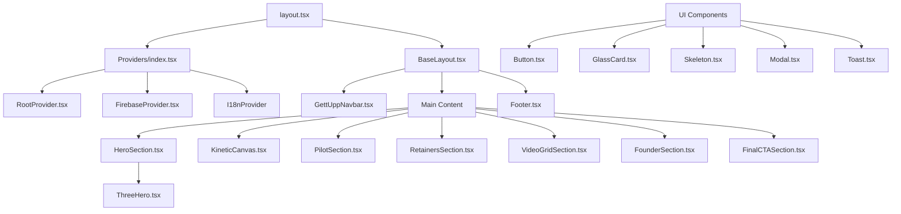

# Application Component Hierarchy

```mermaid
graph TD
    Root[layout.tsx] --> Providers[Providers/index.tsx]
    Providers --> RootProvider[RootProvider.tsx]
    Providers --> FirebaseProvider[FirebaseProvider.tsx]
    Providers --> I18nProvider[I18nProvider]
    
    Root --> BaseLayout[BaseLayout.tsx]
    BaseLayout --> Navbar[GettUppNavbar.tsx]
    BaseLayout --> Main[Main Content]
    BaseLayout --> Footer[Footer.tsx]
    
    Main --> Hero[HeroSection.tsx]
    Main --> Kinetic[KineticCanvas.tsx]
    Main --> Pilot[PilotSection.tsx]
    Main --> Retainers[RetainersSection.tsx]
    Main --> VideoGrid[VideoGridSection.tsx]
    Main --> Founder[FounderSection.tsx]
    Main --> CTA[FinalCTASection.tsx]
    
    Hero --> ThreeHero[ThreeHero.tsx]
    
    UI[UI Components] --> Button[Button.tsx]
    UI --> Glass[GlassCard.tsx]
    UI --> Skel[Skeleton.tsx]
    UI --> Modal[Modal.tsx]
    UI --> Toast[Toast.tsx]
```
